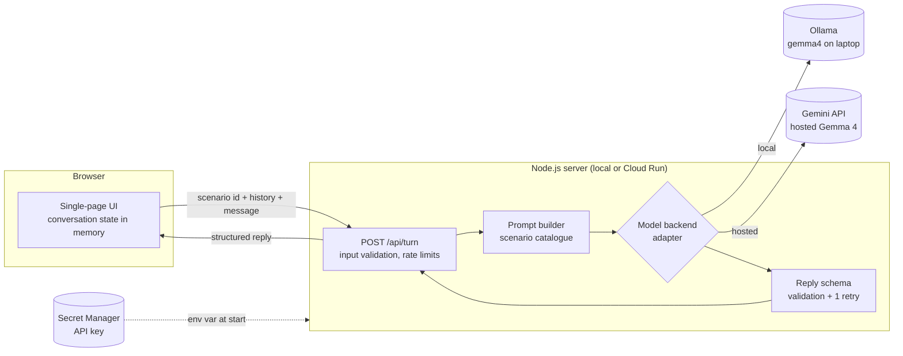

# Design: hanashigemma

- Status: Approved <!-- Draft | In review | Approved -->
- Last updated: 2026-10-04
- Implements: [requirements.md](requirements.md) (REQ-*, NFR-*)

## Overview
One small TypeScript web server serves a static single-page UI and a single JSON API
(`POST /api/turn`). The server is **stateless**: the browser holds the conversation and
sends the full history with each turn. The server builds the prompt for the chosen
scenario, calls Gemma through a **model backend adapter** (local Ollama or hosted Gemma on
the Gemini API), validates the JSON reply against one schema (retrying once), and returns
it. The UI renders the three tiers (furigana, hidden romaji/English, Breakdown +
suggestions) and the Gentle Fix.

Locally the friend runs `npm start` next to Ollama: fully offline and private. The public
demo is the same container on Cloud Run (scale to zero, 1 instance max) using hosted
Gemma, with the API key in Secret Manager.



## Options considered
| Option | Summary | Security | Cost | Effort / risk (≤ 32 h left) | Verdict |
|---|---|---|---|---|---|
| **A. One stateless Node server + backend adapter** (local Ollama / hosted Gemma API), Cloud Run CPU for the demo | Same code everywhere; server holds the key and the limits | Key never reaches the browser; limits enforced server-side | ≈ 0 USD (scale to zero; Gemma API is free-only) | Low: one service, one endpoint | **Chosen** — [ADR-0002](../adr/0002-stateless-server-with-gemma-backend-adapter.md) |
| B. Static site only; browser calls Ollama or the Gemini API directly | No server at all | Hosted demo would expose the API key (or require "bring your own key"); Ollama needs CORS changes on the friend's laptop | 0 USD | Lowest code, but no safe public demo and awkward local setup | Rejected |
| C. Self-host Gemma on Cloud Run with GPU (Ollama/vLLM) | Our own Gemma endpoint on GCP | Private model endpoint | GPU billing, quota request needed; breaks the 5 USD/month budget | High: quota approval alone can exceed the deadline | Rejected (product non-goal) |

## Components
| Component | Responsibility | Tech / GCP service | Requirements |
|---|---|---|---|
| Web UI | Scenario picker, chat view, ruby furigana, toggles, Breakdown, suggestions, Gentle Fix card, About panel, error/rate messages | Static HTML + CSS + TypeScript compiled by `tsc` (no UI framework, no CSS framework — fewer dependencies, faster to build) | REQ-001, 002, 004–009, 012; NFR-009, 010 |
| HTTP server | Serves static files and the API; security headers; health endpoint | Node.js 22 LTS + Hono (`hono`, `@hono/node-server`) | REQ-002, 010; NFR-001, 003 |
| Turn handler | Validates the request, applies rate limits, orchestrates prompt → model → validation → retry | TypeScript module | REQ-002, 003, 011 |
| Scenario catalogue | The 3 scenarios: id, title, learner goal, Gemma's role, opening instruction | Static TypeScript data | REQ-001 |
| Prompt builder | System prompt: role, beginner level, desu/masu, output schema, Gentle Fix rules, steering back to the scene | TypeScript module | REQ-002, 006–008 |
| Model backend adapter | `generate(messages, schema) → string`; two implementations; timeout 45 s per attempt | Ollama REST `/api/chat` with a JSON-schema `format`; Gemini API REST `generateContent` via `fetch` | REQ-010; NFR-004 |
| Reply validator | Parse JSON, validate with zod, cross-checks (segments join, breakdown phrases present), drop invalid breakdown items | `zod` (v4) | REQ-003, 004, 006, 008 |
| Rate limiter | Per-client per-minute limit and per-UTC-day cap (hosted backend only); in memory | TypeScript module | REQ-011 |
| Config loader | Reads and validates env vars at startup; fails fast | `zod` | REQ-010 |
| Logger | One JSON log line per turn, no message content | `console` JSON to stdout (Cloud Logging parses it on Cloud Run) | NFR-007, 002 |
| Container image | Same image locally and on GCP | Multi-stage `Dockerfile` (`node:22-slim` pinned by digest, non-root `node` user, production deps only) + `.dockerignore` | REQ-010; NFR-001 |
| Hosting (demo) | Run the container; inject the API key | Cloud Run (CPU, min 0 / max 1 instance), deployed from source with `gcloud run deploy --source` (Cloud Build builds the Dockerfile, Artifact Registry stores the image), Secret Manager | NFR-005, 006 |

## Data model
No database. All data is transient.

**Turn request** (browser → server):
```ts
{
  scenarioId: "shinjuku-ticket" | "izakaya-ramen" | "kyoto-directions",
  history: Array<{ role: "learner" | "gemma"; text: string }>, // gemma text = reply Japanese only
  message: string | null // null = start the scene (Gemma speaks first)
}
```
Limits: `message` 1–200 characters after trimming; learner entries in `history` ≤ 29
(so the 30th message is the last, AC-002.5); every history entry ≤ 400 characters;
request body ≤ 32 KB.

**Reply** (model → server → browser), validated with zod:
```ts
{
  jp: string,                                         // full Japanese reply
  segments: Array<{ text: string; reading?: string }>, // join(text) === jp; reading (hiragana) required if text contains kanji
  romaji: string,
  en: string,
  breakdown: Array<{ phrase: string; explanation: string }>, // 1–4; phrase must occur in jp
  suggestions: Array<{ jp: string; romaji: string; en: string }>, // 1–2
  fix: null | {
    original: string,
    natural: string,
    issue: "particle" | "politeness" | "vocabulary" | "grammar" | "other",
    explanation: string
  },
  sceneEnded: boolean // true only on the closing message (AC-002.5)
}
```
Kanji detection uses the Unicode CJK Unified Ideographs ranges; hiragana readings are
checked to contain only hiragana and the prolonged sound mark (ー).

**Classification:** learner messages are personal/confidential and transient
(NFR-002). They exist only in the browser tab and in-flight requests; they are never
logged or stored. On the hosted backend they are sent to Google (see Security design).

## Interfaces
| Endpoint | Purpose | Success | Errors |
|---|---|---|---|
| `GET /` and static assets | UI | 200 | 404 |
| `GET /api/config` | Backend label and model name for the badge and About panel (AC-010.5, AC-012.1); scenario list (AC-001.1) | 200 `{ backend, model, scenarios[] }` | — |
| `POST /api/turn` | One turn (start or reply) | 200 Reply | 400 `invalid_request` (bad scenario, empty/too long message, too much history) · 429 `rate_limited` (per minute) · 503 `demo_busy` (daily cap or upstream quota) · 502 `model_invalid_output` (two invalid attempts) · 504/503 `model_unavailable` (timeout or unreachable) |
| `GET /healthz` | Liveness | 200 `ok` | — |

Errors are JSON `{ error: <code>, message: <human text> }`. The UI maps each code to the
messages required by AC-002.4, AC-003.3, AC-010.3, AC-011.1–3, and on any error keeps
the learner's text in the input.

**Configuration (env vars):** `GEMMA_BACKEND` = `ollama` (default) | `gemini`;
`GEMMA_MODEL` (default `gemma4:e4b` for Ollama, `gemma-4-26b-a4b-it` for Gemini — see D-3);
`OLLAMA_URL` (default `http://127.0.0.1:11434`); `GEMINI_API_KEY` (required when
`GEMMA_BACKEND=gemini`, injected from Secret Manager); `PORT` (default 8080);
`DAILY_TURN_CAP` (default 500); `PER_MINUTE_LIMIT` (default 10).

**Model call contract:** the prompt asks for JSON only, matching the schema, with a
compact example. Ollama receives the JSON schema (derived from zod with
`z.toJSONSchema`) in its `format` field. For the Gemini API, structured-output support
for Gemma models is not documented, so the design does **not** depend on it: the server
asks for JSON in the prompt, strips a surrounding Markdown code fence if present, and
relies on validation + one retry (AC-003.2). The retry adds the validation error to the
prompt ("Your previous answer was invalid because …").

## Security design
- Identities: one dedicated service account for the Cloud Run service
  (`hanashigemma-run`). The human deploys with their own identity; CI has no GCP access in
  v1.
- IAM (least privilege): the service account gets only
  `roles/secretmanager.secretAccessor` **on the single API-key secret** (resource-level
  binding). No project-level roles. Cloud Build uses its default identity to build the
  image (human-triggered).
- **Public access exception:** the demo must be open to anonymous judges, so the Cloud
  Run service allows unauthenticated invocation. This deviates from the global
  "no `allUsers`" rule; the alternative (load balancer + Cloud Armor) costs more than the
  whole budget. Mitigations: app-level rate limits (REQ-011), max 1 instance, no data
  stored, no other resources reachable by the service account. Recorded in
  [ADR-0004](../adr/0004-public-unauthenticated-demo-on-cloud-run.md); the service is
  deleted or made private after judging.
- Secrets: one secret, the Gemini API key, in Secret Manager. The human creates it and
  adds the value from stdin (`gcloud secrets versions add --data-file=-`), so the value
  never enters the repo, shell history or Terraform state. The key should be restricted to
  the Generative Language API in the Google Cloud console.
- Network exposure: one public HTTPS endpoint (Cloud Run default URL). Ollama listens only
  on localhost on the friend's laptop.
- Data protection: no storage; TLS by Cloud Run. **The hosted demo sends messages to the
  Gemini API, whose free tier may use content to improve Google products.** The UI shows
  a one-line notice on the hosted backend ("Demo messages are processed by Google's
  Gemini API. For private practice, run HanashiGemma locally.") and the About panel and
  README say the same. The privacy claim of the submission applies to the local mode.
- Threats considered:
  | Threat | Mitigation |
  |---|---|
  | XSS through model or learner text | Render only with `textContent` / created elements, never `innerHTML`; CSP `default-src 'self'; script-src 'self'; object-src 'none'; base-uri 'none'; frame-ancestors 'none'` (NFR-001) |
  | Prompt injection by the learner ("ignore your role…") | Only affects their own session; output is still schema-validated and rendered as text; the model has no tools or data access |
  | Quota exhaustion / cost abuse of the demo | Per-client per-minute limit, daily cap, max 1 instance, request size limits (REQ-011) |
  | Oversized requests | Body ≤ 32 KB, message ≤ 200 chars, bounded history |
  | Secret leak | Key only in Secret Manager → env var; config errors never print values (AC-010.2); gitleaks |
  | Leaking learner text in logs | Logger accepts only a fixed set of metadata fields (NFR-002, NFR-007) |

## Reliability and operations
- Failure modes and handling:
  | Failure | Handling |
  |---|---|
  | Invalid JSON / schema / cross-check | One retry with the error fed back; then 502 `model_invalid_output` (AC-003.3) |
  | Ollama not running | Connection refused → 503 `model_unavailable` with "Start Ollama" hint (AC-010.3) |
  | Model slow | `AbortSignal.timeout(45_000)` per attempt → 504 `model_unavailable` |
  | Gemini quota / 429 | 503 `demo_busy` (AC-011.3) |
  | Instance restart | In-memory rate counters reset; acceptable for a demo — the Gemma API is free-only, so this cannot create cost, only use more of the quota |
- Observability: JSON log line per turn (NFR-007) → Cloud Logging. No dashboards or
  alerts beyond the billing budget for v1.
- Backups / recovery: nothing to back up. Recovery = redeploy the image.

## Environments and deployment
- **Local (primary):** `ollama pull gemma4:e4b` (or `gemma4:e2b` on weaker laptops),
  then `npm ci && npm run build && npm start`; open `http://localhost:8080`.
- **Demo (one environment):** one GCP project, region `europe-southwest1`, set up and
  deployed with `gcloud` by the human (D-5, [ADR-0005](../adr/0005-deploy-demo-with-gcloud-terraform-deferred.md)).
  The commands live in `docs/deploy.md`:
  1. Once: enable `run`, `cloudbuild`, `artifactregistry`, `secretmanager` APIs; create
     the `gemini-api-key` secret and add its value from stdin; create the
     `hanashigemma-run` service account and grant it `secretAccessor` on that secret only;
     create a 5 USD billing budget with 50/90/100% alerts.
  2. Every release: `gcloud run deploy hanashigemma --source . --region=europe-southwest1
     --service-account=hanashigemma-run@… --set-secrets=GEMINI_API_KEY=gemini-api-key:latest
     --set-env-vars=GEMMA_BACKEND=gemini,GEMMA_MODEL=gemma-4-26b-a4b-it
     --allow-unauthenticated --min-instances=0 --max-instances=1 --memory=512Mi`.
  CI (GitHub Actions) runs lint, typecheck, tests and audit; it does **not** deploy in v1.
  `infra/` stays as the scaffold until the Terraform port (T-011).
- Rollback: `gcloud run services update-traffic hanashigemma --to-revisions=<previous>=100`.
  Removing the demo after judging: `gcloud run services delete hanashigemma` (human).
- **Stretch (post-deadline, optional):** self-host Gemma with Ollama on Cloud Run with an
  L4 GPU (T-012). No code change: the Ollama adapter is pointed at that service with
  `OLLAMA_URL`. Needs GPU quota and a GPU region; billed per second while running.

## Testing strategy
- **Unit (Vitest, no network):** reply validator (valid, missing fields, segment join
  mismatch, kanji without reading, breakdown phrase not in reply, code fence stripping),
  request validation, rate limiter (fake clock), config loader, prompt builder (contains
  role, level, schema), log record shape, error mapping.
- **Integration (Vitest, fake backend):** `POST /api/turn` through the Hono app with a
  fake model adapter: happy path, retry then success, retry then 502, timeout, quota →
  503, rate limit → 429, security headers, `/api/config`, `/healthz`.
- **Adapter contract tests:** Ollama and Gemini adapters against a local stub HTTP server
  (request shape, timeout, error mapping). No real model calls in CI.
- **UI:** unit tests for rendering helpers (ruby building, toggles, text-only rendering of
  markup) with `happy-dom` [ASSUMPTION A-6]; manual walkthrough + axe browser extension
  for NFR-009.
- **Evaluation (manual script, real model, not in CI):** `npm run eval` sends ≥ 20 turns
  per scenario and the 10 seeded mistakes, and reports schema pass rate, retries,
  latency p95 and the fixes for hand review (success metrics; ACs marked *Evaluation*).
- AC → test mapping is recorded in each test name (`AC-003.2: retries once on invalid
  output`).

## Cost estimate
Estimate, not a quote:
| Item | Monthly |
|---|---|
| Cloud Run (scale to zero, 1 vCPU / 512 MiB, demo traffic) | ≈ 0 USD (within free tier) |
| Artifact Registry (a few images ≈ 0.5 GB) | < 0.10 USD |
| Secret Manager (1 secret, few accesses) | < 0.10 USD |
| Cloud Build (a few builds) | ≈ 0 USD (free minutes) |
| Gemma 4 on the Gemini API | 0 USD (free tier only; paid tier not offered) |
| **Total** | **< 1 USD**, budget alert at 5 USD (NFR-006) |

## Decisions
| ID | Decision | ADR |
|---|---|---|
| D-1 | Record decisions as ADRs | [0001](../adr/0001-record-architecture-decisions.md) |
| D-2 | One stateless TypeScript server (Hono) + static UI without frameworks; conversation state in the browser; model backend adapter (Ollama / Gemini API) | [0002](../adr/0002-stateless-server-with-gemma-backend-adapter.md) |
| D-3 | Gemma 4: `gemma4:e4b` locally (fallback `gemma4:e2b`), `gemma-4-26b-a4b-it` hosted; JSON via prompt + schema validation + 1 retry | [0003](../adr/0003-gemma-4-models-and-structured-output.md) |
| D-4 | Public demo on Cloud Run with unauthenticated access, mitigated by app-level limits; exception to the "no allUsers" rule | [0004](../adr/0004-public-unauthenticated-demo-on-cloud-run.md) |
| D-5 | Demo deployed by the human with `gcloud run deploy --source` from the repo's Dockerfile; Terraform deferred to after the deadline; CI does not deploy | [0005](../adr/0005-deploy-demo-with-gcloud-terraform-deferred.md) |

## Traceability
| Requirement | Design section(s) |
|---|---|
| REQ-001 | Components (Scenario catalogue, Web UI); Interfaces (`/api/config`, `/api/turn` with `message: null`) |
| REQ-002 | Components (Turn handler, Prompt builder); Data model (request limits); Interfaces |
| REQ-003 | Components (Reply validator); Data model (Reply); Reliability (retry) |
| REQ-004 | Data model (segments, readings); Components (Web UI) |
| REQ-005 | Components (Web UI) |
| REQ-006 | Data model (breakdown cross-check); Prompt builder |
| REQ-007 | Data model (suggestions); Web UI |
| REQ-008 | Data model (`fix`); Prompt builder; Web UI |
| REQ-009 | Web UI (client-side reset) |
| REQ-010 | Components (Model backend adapter, Config loader); Interfaces (configuration) |
| REQ-011 | Components (Rate limiter); Interfaces (429/503); Security (quota abuse) |
| REQ-012 | Interfaces (`/api/config`); Security (hosted-mode notice) |
| NFR-001 | Security design (threats, CSP, secrets) |
| NFR-002 | Data model (classification); Security (data protection, logs) |
| NFR-003 | Interfaces (`/healthz`); Reliability |
| NFR-004 | Model call contract (timeout); Testing (evaluation latency) |
| NFR-005 | Components (Hosting, max 1 instance) |
| NFR-006 | Cost estimate; Environments (budget) |
| NFR-007 | Components (Logger); Reliability (observability) |
| NFR-008 | Security (hosted-mode notice); README (license, Gemma Terms of Use) |
| NFR-009, NFR-010 | Components (Web UI); Testing (UI) |
| NFR-011 | Testing strategy; Environments (CI) |

## Open questions and assumptions
- Q-1 resolved: deadline **2026-10-05 06:59 UTC** (08:59 CEST), from the official DEV
  challenge page. The DEV post must use the challenge template and the tags
  `devchallenge`, `weekendchallenge`, `hf26challenge`; a deployed link **or** a video is
  accepted.
- Q-2 resolved by D-3 (Gemma 4 on Ollama: `e2b`, `e4b`, `12b`, `26b`, `31b`).
- Q-3 partly resolved: the Gemini API offers `gemma-4-31b-it` and `gemma-4-26b-a4b-it`,
  free of charge, no paid tier, and free-tier content may be used to improve Google
  products. **Still open:** the exact Gemma 4 requests-per-day limit for the project's key
  (check in AI Studio → Rate limits); lower `DAILY_TURN_CAP` if it is below ~1,000
  (each turn may take 2 requests).
- A-6: `happy-dom` (dev dependency) is acceptable for UI rendering tests.
- A-7: Hono, `@hono/node-server` and `zod` are acceptable runtime dependencies (all
  widely used, MIT-licensed, maintained).
